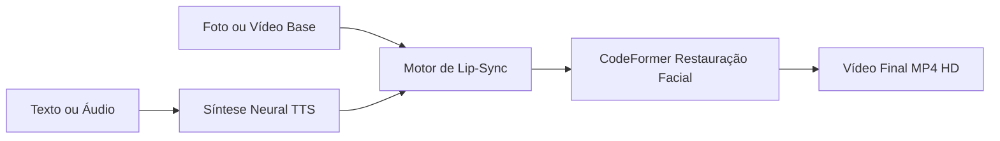

# 🎬 AI Avatar Studio (HeyGen Open-Source)

> Ferramenta completa, moderna e 100% gratuita para criação de **Avatares Falantes Ultra-Realistas com Sincronia Labial e Restauração Facial em Alta Definição**, projetada para rodar com aceleração por GPU NVIDIA (Google Colab ou local).

---

## 🌟 Recursos Principais

- **Voz Natural em Português Brasileiro (e outros idiomas):** Integração com modelos neurais via Edge-TTS (vozes masculinas, femininas e jovens) ou áudio personalizado.
- **Sincronia Labial de Alta Fidelidade (Lip-Sync):** Movimentação precisa dos lábios de acordo com os fonemas do áudio.
- **Restauração e Nitidez Facial (CodeFormer / GFPGAN):** Elimina distorções e borrões comuns em IAs, mantendo dentes, olhos e pele nítidos e naturais.
- **Interface Gráfica Amigável (Gradio WebUI):** Link público para usar pelo navegador sem tocar em linhas de código.
- **Custo Zero:** Executável na GPU NVIDIA T4 gratuita do Google Colab sem necessidade de cartão de crédito ou assinaturas.

---

## 📐 Arquitetura do Pipeline



---

## 🚀 Como Usar no Google Colab (Passo a Passo)

1. Abra o [Google Colab](https://colab.research.google.com/).
2. Faça o upload ou abra o arquivo `avatar_generator_colab.ipynb`.
3. No menu superior, clique em **Ambiente de execução** > **Alterar tipo de ambiente de execução** e escolha **GPU T4**.
4. Execute a **Etapa 1** (Instalação das dependências e modelos).
5. Execute a **Etapa 2** (Iniciar a WebUI).
6. Clique no link gerado `Running on public URL: https://xxxx.gradio.live` para abrir a interface no seu navegador.

---

## 💻 Estrutura do Repositório

```text
├── avatar_generator_colab.ipynb   # Notebook completo para execução em 1 clique no Colab
├── app.py                         # Interface gráfica Web com Gradio
├── requirements.txt               # Dependências do projeto
├── pipeline/
│   ├── tts.py                     # Síntese de voz neural em múltiplos idiomas
│   ├── lipsync.py                 # Motor de sincronia labial
│   └── enhancer.py                # Restauração e nitidez facial com CodeFormer
└── README.md                      # Documentação do projeto
```

---

## 📦 Como Subir este Projeto para o seu GitHub

Para enviar este projeto para o seu repositório no GitHub, abra o terminal nesta pasta e execute:

```bash
# 1. Iniciar o repositório git local (já configurado)
git init

# 2. Adicionar os arquivos
git add .
git commit -m "feat: initial commit - ai avatar generator heygen open-source"

# 3. Vincular ao seu repositório remoto no GitHub
# (Substitua SEU_USUARIO e SEU_REPOSITORIO pela sua URL)
git branch -M main
git remote add origin https://github.com/SEU_USUARIO/SEU_REPOSITORIO.git

# 4. Enviar os arquivos
git push -u origin main
```

---

## 📄 Licença
Este projeto é distribuído para fins educacionais e de pesquisa, utilizando modelos abertos sob suas respectivas licenças de código aberto (Wav2Lip, CodeFormer, Edge-TTS).
